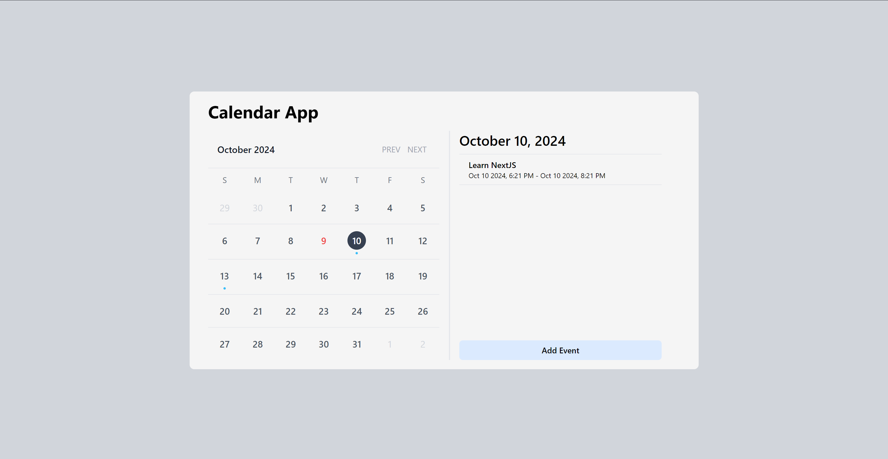
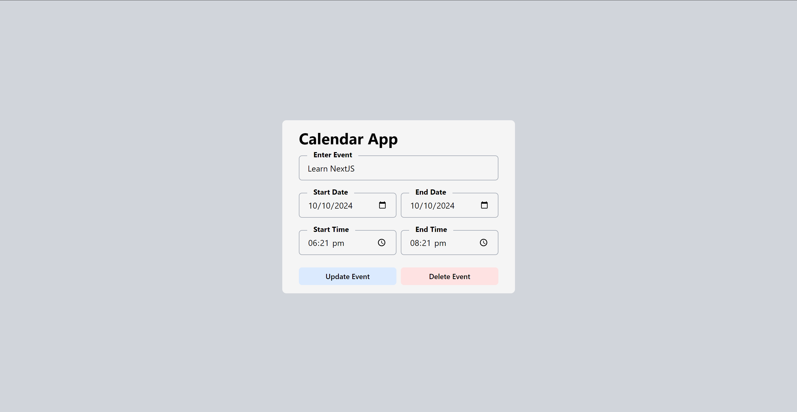

# My calendar

**Tier:** 3-Advanced

## Challenge

Build a calendar application to organize you daily life. Add functionality to add events and reminder.
Style your own calendar according to your requirement. [Original Challenge](https://github.com/florinpop17/app-ideas/blob/master/Projects/1-Beginner/Calendar-App.md)

- Understanding how calendar application works
- Only basic understanding of HTML/CSS and JS is required
- Working on more features help you learning advance concepts of JS

## Screenshot

## User Stories

- [x] User can create event
- [x] User can edit event
- [x] User can delete event

## Bonus features

- [x] User can drag events between dates
- [ ] User can set reminder for a event
- [ ] Change theme (light/dark) (play with css), play with css 😄
- [x] Store data locally so that events does not get deleted when server is restarted

## Built With

- HTML5 markup
- TailwindCSS - For styles
- NextJS
- date-fns - For calendar functionality
- uuid - For generating unique id
- React Hook Form - For managing form and basic validation

## Continued Development

- Learn how to toggle light and dark mode using TailwindCSS

## Useful links and resources

- [Local Storage](https://blog.logrocket.com/the-complete-guide-to-using-localstorage-in-javascript-apps-ba44edb53a36/)
- [MDN](https://developer.mozilla.org/en-US/)
- [Design Ideas](https://dribbble.com/tags/calendar)